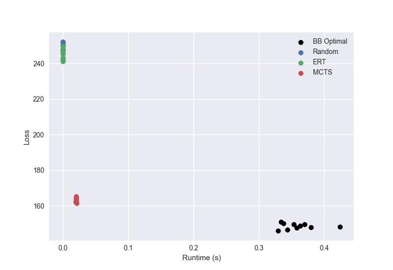

# Notes
- Sorting effects
  - t_release: good
  - slope: moderate
  - duration: equally good!
- Shifting: very good
- Sort + shift = even better!
  - Negligible improvement from masking or encoding!
  
- Without sorting/shifting
  - Encoding-only and masking-only provide comparable improvement, minimal synergy
  
- TODO: investigate training sample weighting
  
- CNN: TODO

---

Problem gen: Dataset
---
1 channel, 8 tasks

Channel: UniformIID(0.0, 0.0)

DiscreteIID
---
Task class: ReluDrop

|   duration |    Pr |
|------------|-------|
|      3.000 | 0.500 |
|      6.000 | 0.500 |

|   t_release |    Pr |
|-------------|-------|
|       0.000 | 0.500 |
|       4.000 | 0.500 |

|   slope |    Pr |
|---------|-------|
|   0.500 | 0.500 |
|   2.000 | 0.500 |

|   t_drop |    Pr |
|----------|-------|
|    6.000 | 0.500 |
|   12.000 | 0.500 |

|   l_drop |    Pr |
|----------|-------|
|   35.000 | 0.500 |
|   50.000 | 0.500 |

Number of problems: 1000

---

Non-learning results
---
- seed = 12345
- n_mc = 10
- n_gen = 100

|            |   Excess Loss (%) |    Loss |   Runtime |
|------------|-------------------|---------|-----------|
| BB Optimal |             0.000 | 148.531 |     0.359 |
| Random     |             0.683 | 249.906 |     0.000 |
| ERT        |             0.647 | 244.616 |     0.000 |
| MCTS       |             0.104 | 163.914 |     0.017 |



---


# 2021-03-09_14-35-52

Env: StepTasking
---

- Features: ['duration', 't_release', 'slope', 't_drop', 'l_drop']
- Sorting: None
- Task shifting: False
- Masking: False
- Valid actions: False
- Sequence encoding: one-hot

Model
---
```
Model: "sequential"
_________________________________________________________________
Layer (type)                 Output Shape              Param #   
=================================================================
flatten (Flatten)            (None, 104)               0         
_________________________________________________________________
dense (Dense)                (None, 30)                3150      
_________________________________________________________________
dense_1 (Dense)              (None, 8)                 248       
=================================================================
Total params: 3,398
Trainable params: 3,398
Non-trainable params: 0
_________________________________________________________________
```

Training problems = 900

Results
---
- n_mc = 10
- n_gen = 100

|            |   Excess Loss (%) |    Loss |   Runtime |
|------------|-------------------|---------|-----------|
| BB Optimal |             0.000 | 148.531 |     0.359 |
| NN         |             0.467 | 217.916 |     0.008 |


# 2021-03-09_14-53-04

Env: StepTasking
---

- Features: ['duration', 't_release', 'slope', 't_drop', 'l_drop']
- Sorting: t_release
- Task shifting: False
- Masking: False
- Valid actions: False
- Sequence encoding: one-hot

Model
---
```
Model: "sequential"
_________________________________________________________________
Layer (type)                 Output Shape              Param #   
=================================================================
flatten (Flatten)            (None, 104)               0         
_________________________________________________________________
dense (Dense)                (None, 30)                3150      
_________________________________________________________________
dense_1 (Dense)              (None, 8)                 248       
=================================================================
Total params: 3,398
Trainable params: 3,398
Non-trainable params: 0
_________________________________________________________________
```

Training problems = 900

Results
---
- n_mc = 10
- n_gen = 100

|            |   Excess Loss (%) |    Loss |   Runtime |
|------------|-------------------|---------|-----------|
| BB Optimal |             0.000 | 148.531 |     0.359 |
| NN         |             0.261 | 187.263 |     0.008 |


# 2021-03-09_14-56-44

Env: StepTasking
---

- Features: ['duration', 't_release', 'slope', 't_drop', 'l_drop']
- Sorting: None
- Task shifting: True
- Masking: False
- Valid actions: False
- Sequence encoding: one-hot

Model
---
```
Model: "sequential"
_________________________________________________________________
Layer (type)                 Output Shape              Param #   
=================================================================
flatten (Flatten)            (None, 104)               0         
_________________________________________________________________
dense (Dense)                (None, 30)                3150      
_________________________________________________________________
dense_1 (Dense)              (None, 8)                 248       
=================================================================
Total params: 3,398
Trainable params: 3,398
Non-trainable params: 0
_________________________________________________________________
```

Training problems = 900

Results
---
- n_mc = 10
- n_gen = 100

|            |   Excess Loss (%) |    Loss |   Runtime |
|------------|-------------------|---------|-----------|
| BB Optimal |             0.000 | 148.531 |     0.359 |
| NN         |             0.131 | 168.023 |     0.008 |


# 2021-03-09_15-06-08

Env: StepTasking
---

- Features: ['duration', 't_release', 'slope', 't_drop', 'l_drop']
- Sorting: t_release
- Task shifting: True
- Masking: False
- Valid actions: False
- Sequence encoding: one-hot

Model
---
```
Model: "sequential"
_________________________________________________________________
Layer (type)                 Output Shape              Param #   
=================================================================
flatten (Flatten)            (None, 104)               0         
_________________________________________________________________
dense (Dense)                (None, 30)                3150      
_________________________________________________________________
dense_1 (Dense)              (None, 8)                 248       
=================================================================
Total params: 3,398
Trainable params: 3,398
Non-trainable params: 0
_________________________________________________________________
```

Training problems = 900

Results
---
- n_mc = 10
- n_gen = 100

|            |   Excess Loss (%) |    Loss |   Runtime |
|------------|-------------------|---------|-----------|
| BB Optimal |             0.000 | 148.531 |     0.359 |
| NN         |             0.097 | 162.906 |     0.009 |


# 2021-03-09_15-10-05

Env: StepTasking
---

- Features: ['duration', 't_release', 'slope', 't_drop', 'l_drop']
- Sorting: t_release
- Task shifting: True
- Masking: True
- Valid actions: False
- Sequence encoding: one-hot

Model
---
```
Model: "sequential"
_________________________________________________________________
Layer (type)                 Output Shape              Param #   
=================================================================
flatten (Flatten)            (None, 104)               0         
_________________________________________________________________
dense (Dense)                (None, 30)                3150      
_________________________________________________________________
dense_1 (Dense)              (None, 8)                 248       
=================================================================
Total params: 3,398
Trainable params: 3,398
Non-trainable params: 0
_________________________________________________________________
```

Training problems = 900

Results
---
- n_mc = 10
- n_gen = 100

|            |   Excess Loss (%) |    Loss |   Runtime |
|------------|-------------------|---------|-----------|
| BB Optimal |             0.000 | 148.531 |     0.359 |
| NN         |             0.093 | 162.387 |     0.009 |


# 2021-03-09_15-16-16

Env: StepTasking
---

- Features: ['duration', 't_release', 'slope', 't_drop', 'l_drop']
- Sorting: t_release
- Task shifting: True
- Masking: True
- Valid actions: False
- Sequence encoding: None

Model
---
```
Model: "sequential"
_________________________________________________________________
Layer (type)                 Output Shape              Param #   
=================================================================
flatten (Flatten)            (None, 40)                0         
_________________________________________________________________
dense (Dense)                (None, 30)                1230      
_________________________________________________________________
dense_1 (Dense)              (None, 8)                 248       
=================================================================
Total params: 1,478
Trainable params: 1,478
Non-trainable params: 0
_________________________________________________________________
```

Training problems = 900

Results
---
- n_mc = 10
- n_gen = 100

|            |   Excess Loss (%) |    Loss |   Runtime |
|------------|-------------------|---------|-----------|
| BB Optimal |             0.000 | 148.531 |     0.359 |
| NN         |             0.092 | 162.126 |     0.009 |


# 2021-03-09_15-25-00

Env: StepTasking
---

- Features: ['duration', 't_release', 'slope', 't_drop', 'l_drop']
- Sorting: duration
- Task shifting: True
- Masking: True
- Valid actions: False
- Sequence encoding: one-hot

Model
---
```
Model: "sequential"
_________________________________________________________________
Layer (type)                 Output Shape              Param #   
=================================================================
flatten (Flatten)            (None, 104)               0         
_________________________________________________________________
dense (Dense)                (None, 30)                3150      
_________________________________________________________________
dense_1 (Dense)              (None, 8)                 248       
=================================================================
Total params: 3,398
Trainable params: 3,398
Non-trainable params: 0
_________________________________________________________________
```

Training problems = 900

Results
---
- n_mc = 10
- n_gen = 100

|            |   Excess Loss (%) |    Loss |   Runtime |
|------------|-------------------|---------|-----------|
| BB Optimal |             0.000 | 148.531 |     0.359 |
| NN         |             0.088 | 161.664 |     0.009 |


# 2021-03-09_15-27-43

Env: StepTasking
---

- Features: ['duration', 't_release', 'slope', 't_drop', 'l_drop']
- Sorting: duration
- Task shifting: True
- Masking: True
- Valid actions: False
- Sequence encoding: None

Model
---
```
Model: "sequential"
_________________________________________________________________
Layer (type)                 Output Shape              Param #   
=================================================================
flatten (Flatten)            (None, 40)                0         
_________________________________________________________________
dense (Dense)                (None, 30)                1230      
_________________________________________________________________
dense_1 (Dense)              (None, 8)                 248       
=================================================================
Total params: 1,478
Trainable params: 1,478
Non-trainable params: 0
_________________________________________________________________
```

Training problems = 900

Results
---
- n_mc = 10
- n_gen = 100

|            |   Excess Loss (%) |    Loss |   Runtime |
|------------|-------------------|---------|-----------|
| BB Optimal |             0.000 | 148.531 |     0.359 |
| NN         |             0.088 | 161.603 |     0.008 |


# 2021-03-10_08-49-56

Env: StepTasking
---

- Features: ['duration', 't_release', 'slope', 't_drop', 'l_drop']
- Sorting: None
- Task shifting: False
- Masking: False
- Valid actions: False
- Sequence encoding: None

Model
---
```
Model: "sequential"
_________________________________________________________________
Layer (type)                 Output Shape              Param #   
=================================================================
flatten (Flatten)            (None, 40)                0         
_________________________________________________________________
dense (Dense)                (None, 30)                1230      
_________________________________________________________________
dense_1 (Dense)              (None, 8)                 248       
=================================================================
Total params: 1,478
Trainable params: 1,478
Non-trainable params: 0
_________________________________________________________________
```

Training problems = 900

Results
---
- n_mc = 10
- n_gen = 100

|            |   Excess Loss (%) |    Loss |   Runtime |
|------------|-------------------|---------|-----------|
| BB Optimal |             0.000 | 148.531 |     0.359 |
| NN         |             0.667 | 247.569 |     0.008 |


# 2021-03-10_08-56-14

Env: StepTasking
---

- Features: ['duration', 't_release', 'slope', 't_drop', 'l_drop']
- Sorting: None
- Task shifting: False
- Masking: True
- Valid actions: False
- Sequence encoding: None

Model
---
```
Model: "sequential"
_________________________________________________________________
Layer (type)                 Output Shape              Param #   
=================================================================
flatten (Flatten)            (None, 40)                0         
_________________________________________________________________
dense (Dense)                (None, 30)                1230      
_________________________________________________________________
dense_1 (Dense)              (None, 8)                 248       
=================================================================
Total params: 1,478
Trainable params: 1,478
Non-trainable params: 0
_________________________________________________________________
```

Training problems = 900

Results
---
- n_mc = 10
- n_gen = 100

|            |   Excess Loss (%) |    Loss |   Runtime |
|------------|-------------------|---------|-----------|
| BB Optimal |             0.000 | 148.531 |     0.359 |
| NN         |             0.420 | 210.918 |     0.008 |


# 2021-03-10_09-04-38

Env: StepTasking
---

- Features: ['duration', 't_release', 'slope', 't_drop', 'l_drop']
- Sorting: None
- Task shifting: False
- Masking: True
- Valid actions: False
- Sequence encoding: one-hot

Model
---
```
Model: "sequential"
_________________________________________________________________
Layer (type)                 Output Shape              Param #   
=================================================================
flatten (Flatten)            (None, 104)               0         
_________________________________________________________________
dense (Dense)                (None, 30)                3150      
_________________________________________________________________
dense_1 (Dense)              (None, 8)                 248       
=================================================================
Total params: 3,398
Trainable params: 3,398
Non-trainable params: 0
_________________________________________________________________
```

Training problems = 900

Results
---
- n_mc = 10
- n_gen = 100

|            |   Excess Loss (%) |    Loss |   Runtime |
|------------|-------------------|---------|-----------|
| BB Optimal |             0.000 | 148.531 |     0.359 |
| NN         |             0.405 | 208.737 |     0.008 |

