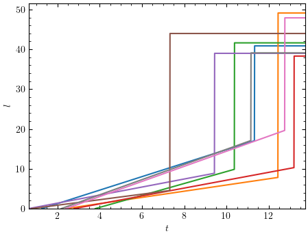
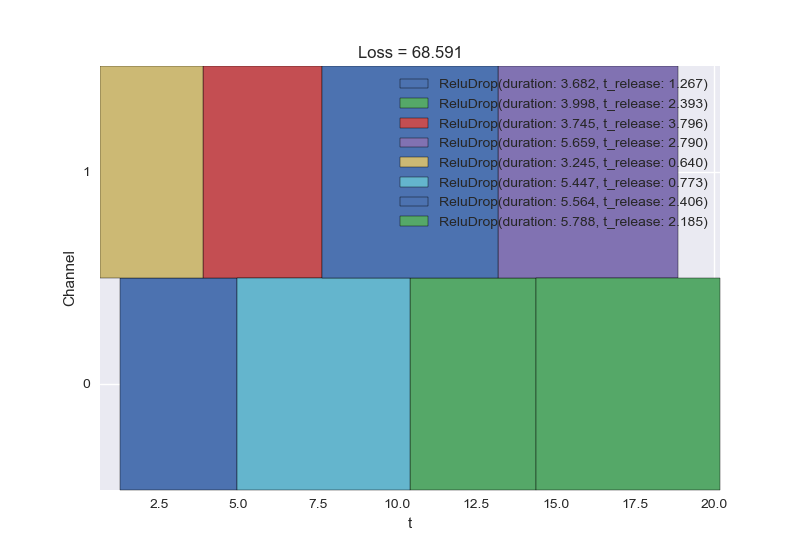
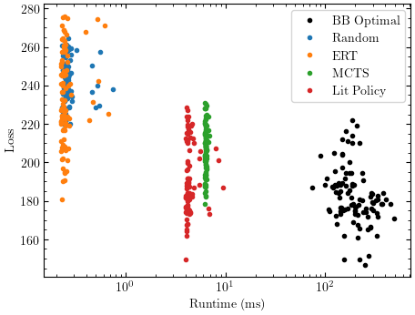
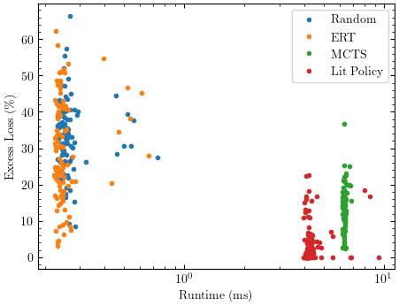

# Task Scheduling
This package provides a framework for implementing task scheduling algorithms and assessing their performance. It 
includes traditional schedulers as well as both supervised and reinforcement learning schedulers.

## Installation
The `task_scheduling` package has not been published to public code repositories. To install the local package, run
`pip install -e .` from the top-level repository directory.

## Documentation
API documentation is provided locally at `docs/API/index.html`

## Development
`task-scheduling` is being developed for the Cognitive Resource Management project @ U.S. Naval Research Laboratory. It is maintained by [Paul Rademacher](https://github.com/rademacher-p) and NRL Radar Division. For contribution and/or collaboration, please [contact us](mailto:paul.rademacher@nrl.navy.mil,kevin.wagner@nrl.navy.mil).

## Quickstart

### Tasks
Task objects must expose two attributes:
- `duration` - the time required to execute a task
- `t_release` - the earliest time at which a task may be executed

The tasks must implement a `__call__` method that provides a monotonic non-decreasing loss function quantifying the
penalty for delayed execution. 

One generic built-in task type is provided: `task_scheduling.tasks.PiecewiseLinear`; also included are special 
subclasses `Linear` and `LinearDrop`. The latter type is so-named because it implements a loss 
function that increases linearly from zero according to a positive parameter `slope` and then after a "drop" time 
`t_drop`, a large constant loss `l_drop` is incurred. Example loss functions are shown below.




### Algorithms
The task scheduling problem is defined using two variables:
- `tasks`, an array of task objects
- `ch_avail`, an array of channel availability times

and the scheduling solution is defined using a 
[NumPy structured array](https://numpy.org/doc/stable/user/basics.rec.html) `sch` of length `len(tasks)` with two 
fields:
- `t`, execution times (`float`)
- `c`, execution channels (`int`, in `range(len(ch_avail))`)

To be valid (as assessed using `util.check_schedule`), the execution times, execution channels, and task
durations must be such that no two tasks on the same channel are executing at the same time.

Each algorithm is a Python `callable` implementing the same API; it takes two leading positional arguments `tasks` and
`ch_avail` and returns the schedule array `sch`. An example schedule is shown below.



#### Traditional schedulers
A variety of classic schedulers are provided in the `algorithms` subpackage:

- Optimal
  - Branch and Bound (B&B)
  - Brute force
- Searches
  - Monte Carlo Tree Search (MCTS)
- Fast heuristics
  - Earliest release time
  - Earliest drop time
  - Random sequencer

#### Learning schedulers
Traditional schedulers typically suffer from one of two drawbacks: high computational load or poor performance. New
algorithms that learn from related problems may generalize well, finding near-optimal schedules in a 
shorter, more practical amount of runtime. 

The `mdp` subpackage implements the scheduling problem as a Markov decision process for supervised and reinforcement 
learning. Scheduling environments are provided in `mdp.environments`, following the 
[OpenAI Gym](https://gym.openai.com/) API. The primary `Env` class is `Index`; this environment uses single task 
assignments as actions and converts the scheduling problem (tasks and channel availabilities) into observed states, 
including the status of each task. The `mdp.supervised` subpackage provides scheduler objects that use policy 
networks (implemented with [PyTorch](https://pytorch.org/)) to learn from these environments. The `mdp.reinforcement` submodule provides schedulers that implement and use agents from [Stable-Baselines3](https://stable-baselines3.readthedocs.io/en/master/); also included are special policies for Actor-Critic and DQN that enforce valid actions throughout the MDP episode.

### Evaluation
The primary metrics used to evaluate a scheduling algorithm are its achieved loss and its runtime. The 
`util.evaluate_schedule` function calculates the total loss; the `util.eval_wrapper` function allows 
any scheduler to be timed and assessed. 

While these functions can be invoked directly, the package provides a number of convenient functions in the 
`util.results` subpackage that automate this functionality, allow printing result tables to file, provide visuals, etc.
The functions `evaluate_algorithms_single` and `evaluate_algorithms_gen` assess for single scheduling problems and
across a set of generated problems, respectively. The function `evaluate_algorithms_train` adds an additional level of 
Monte Carlo iteration by re-training any learning schedulers a number of times. 

Example result outputs are shown below for `evaluate_algorithms_gen`. The first scatter plot shows raw loss-runtime 
pairs, one for each scheduling problem; the second plot shows excess loss values relative to optimal. The Markdown
format table provides the average values.




```markdown
|            |   Excess Loss (%) |    Loss |   Runtime (ms) |
|------------|-------------------|---------|----------------|
| BB Optimal |             0.000 | 182.440 |        207.535 |
| Random     |            33.041 | 242.720 |          0.274 |
| ERT        |            28.525 | 234.481 |          0.260 |
| MCTS       |            13.284 | 206.675 |          6.340 |
| Lit Policy |             4.188 | 190.079 |          4.438 |
```

## Examples

### Basics (`examples/basics.py`)
The following example shows a single scheduling problem and solution. Tasks are created using one of the provided
generators and a number of algorithms provide scheduling solutions. Built-in utilities help visualize the both the 
problem and the various solutions.

```python
from matplotlib import pyplot as plt

from task_scheduling import algorithms
from task_scheduling.generators import tasks as task_gens
from task_scheduling.util import summarize_tasks, plot_task_losses, plot_schedule, check_schedule, evaluate_schedule

plt.style.use('../images/style.mplstyle')
seed = 12345

# Define scheduling problem
task_gen = task_gens.ContinuousUniformIID.linear_drop(rng=seed)

tasks = list(task_gen(8))
ch_avail = [0., 0.5]

print(summarize_tasks(tasks))
plot_task_losses(tasks)


# Define and assess algorithms
algorithms = dict(
    Optimal=algorithms.branch_bound_priority,
    Random=algorithms.random_sequencer,
)

__, axes = plt.subplots(len(algorithms))
for (name, algorithm), ax in zip(algorithms.items(), axes):
    sch = algorithm(tasks, ch_avail)

    check_schedule(tasks, sch)
    loss = evaluate_schedule(tasks, sch)
    plot_schedule(tasks, sch, loss=loss, name=name, ax=ax)

plt.show()
```

### Policy learning and Monte Carlo assessment (`examples/learning.py`)
The following example demonstrates the definition of a scheduling problem generator, the creation of a learning
scheduler using PyTorch Lightning, and the comparison of traditional vs. learning schedulers using Monte Carlo
evaluation.

Note that the problem generator is used to instantiate the Environment, which is used to create and train the 
supervised learning policy. Also, note the structure of the `algorithms` array; each algorithm is has a name, a 
`callable`, and a number of iterations to perform per problem (averaging is best-practice for stochastic schedulers).

```python
from functools import partial

import numpy as np
import pandas as pd
import torch
from matplotlib import pyplot as plt
from pytorch_lightning.callbacks import EarlyStopping
from pytorch_lightning.utilities.seed import seed_everything
from stable_baselines3.common.callbacks import StopTrainingOnNoModelImprovement
from torch import nn

from task_scheduling.algorithms import mcts, random_sequencer, earliest_release
from task_scheduling.generators import problems as problem_gens
from task_scheduling.mdp.environments import Index
from task_scheduling.mdp.reinforcement import StableBaselinesScheduler, ValidActorCriticPolicy, MultiExtractor
from task_scheduling.mdp.supervised.torch import LitScheduler
from task_scheduling.results import evaluate_algorithms_train, evaluate_algorithms_gen

np.set_printoptions(precision=3)
pd.options.display.float_format = '{:,.3f}'.format
plt.style.use('../images/style.mplstyle')
seed = 12345

if seed is not None:
    seed_everything(seed)


# Define scheduling problem and algorithms
problem_gen = problem_gens.Dataset.load('../data/continuous_linear_drop_c1t8', repeat=True)
# problem_gen = problem_gens.Random.discrete_linear_drop(n_tasks=8, n_ch=1, rng=seed)

env_params = {
    'features': None,  # defaults to task parameters
    'sort_func': 't_release',
    'time_shift': True,
    'masking': True,
}

env = Index(problem_gen, **env_params)


learn_params = {
    'batch_size_train': 20,
    'n_gen_val': 1 / 3,
    'batch_size_val': 30,
    'max_epochs': 2000,
    'shuffle': True,
}
trainer_kwargs = {
    'logger': False,
    'checkpoint_callback': False,
    'callbacks': EarlyStopping('val_loss', min_delta=0., patience=50),
    'gpus': torch.cuda.device_count(),
}
lit_scheduler = LitScheduler.mlp(env, hidden_sizes_joint=[400], model_kwargs={'optim_params': {'lr': 1e-4}},
                                 trainer_kwargs=trainer_kwargs, learn_params=learn_params)


learn_params_sb = {
    'n_gen_val': 1/3,
    'max_epochs': 2000,
    'eval_callback_kwargs': dict(callback_after_eval=StopTrainingOnNoModelImprovement(1000, min_evals=0, verbose=1),
                                 n_eval_episodes=100, eval_freq=1000, verbose=1),
}
sb_model_kwargs = dict(
    policy=ValidActorCriticPolicy,
    policy_kwargs=dict(
        features_extractor_class=MultiExtractor.mlp,
        features_extractor_kwargs=dict(hidden_sizes_ch=[], hidden_sizes_tasks=[]),
        net_arch=[400],
        activation_fn=nn.ReLU,
        normalize_images=False,
        infer_valid_mask=env.infer_valid_mask,
    ),
)
sb_scheduler = StableBaselinesScheduler.make_model(env, 'PPO', sb_model_kwargs, learn_params_sb)


algorithms = np.array([
    ('Random', random_sequencer, 10),
    ('ERT', earliest_release, 10),
    ('MCTS', partial(mcts, max_runtime=np.inf, max_rollouts=10, c_explore=.05, th_visit=5), 10),
    ('SL Policy', lit_scheduler, 10),
    ('RL Agent', sb_scheduler, 10),
], dtype=[('name', '<U32'), ('func', object), ('n_iter', int)])


# Evaluate results
n_gen_learn = 900  # the number of problems generated for learning, per iteration
n_gen = 100  # the number of problems generated for testing, per iteration
n_mc = 10  # the number of Monte Carlo iterations performed for scheduler assessment

loss_mc, t_run_mc = evaluate_algorithms_train(algorithms, problem_gen, n_gen, n_gen_learn, n_mc, solve=True,
                                              verbose=1, plotting=1, rng=seed)
# loss_mean, t_run_mean = evaluate_algorithms_gen(algorithms, problem_gen, n_gen, n_gen_learn, solve=True,
#                                                 verbose=1, plotting=1, rng=seed)

plt.show()
```