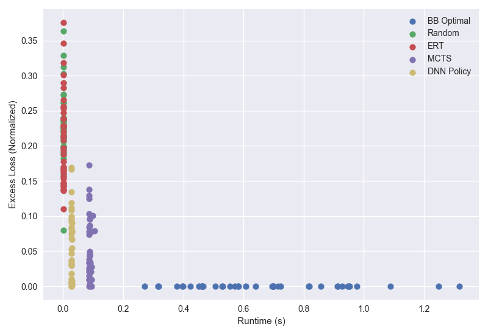
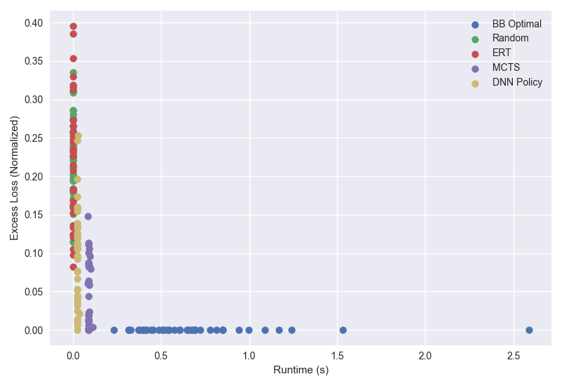

# CRM Results

## Continuous ReLU tasks

### 12 tasks  

- FNN, sort t_release

Algorithm                          | Loss    | Runtime (s)
---------                          | ----    | -----------
BB Optimal                         | 341.11  | 0.671799  
Random                             | 416.67  | 0.001125  
ERT                                | 411.16  | 0.001177  
MCTS                               | 357.70  | 0.089069  
DNN Policy                         | 359.65  | 0.028278  

- FNN, no sort

Algorithm                          | Loss    | Runtime (s)
---------                          | ----    | -----------
BB Optimal                         | 341.45  | 0.696004  
Random                             | 415.09  | 0.001158  
ERT                                | 415.05  | 0.001187  
MCTS                               | 358.01  | 0.090563  
DNN Policy                         | 372.95  | 0.026667  

