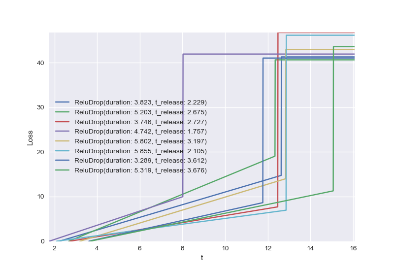

# Cognitive Resource Management
This package provides a framework for implementing task scheduling algorithms and assessing their performance. It includes
traditional schedulers as well as both supervised and reinforcement learning schedulers.

## Installation
The `task_scheduling` package has not been published to public code repositories. To install the local package, run
`pip install -e .` from the top-level repository directory.

## Algorithms
The common API for the task scheduling problem assumes that an algorithm is a Python callable with (at least) two arguments:
- `tasks` - an array of task objects
- `ch_avail` - an array of channel availability times

The number of tasks is the `len(tasks)` and the number of channels is `len(ch_avail)`

Each algorithm returns two objects:
- `t_ex` - an array of execution times, one for each task
- `ch_ex` - an array of execution channels, one for each task

Built-in algorithms include traditional schedulers:
- Branch and Bound (B&B)
- Brute force search
- Monte Carlo Tree Search (MCTS)
- Earliest release time
- Earliest drop time
- Random sequencer

TODO: add learner descriptions

## Tasks
Task objects must expose two attributes:
- `duration` - the time required to execute a task
- `t_release` - the earliest time that a task may be executed

The tasks must implement a `__call__` method that provides a monotonic non-decreasing loss function quantifying the
penalty for delayed execution. 

One built-in task type is provided: `task_scheduling.tasks.ReluDrop`. It is so-named because it implements a loss function
that is linearly increasing from zero until a "drop" time, after which a constant loss is incurred. It uses additional
parameters `slope`, `t_drop`, and `l_drop` to quantify the dropping behavior. Example loss functions are shown below.

## The `TreeNode` object
TODO

## Evaluation
TODO: detail functions, provide example output.
